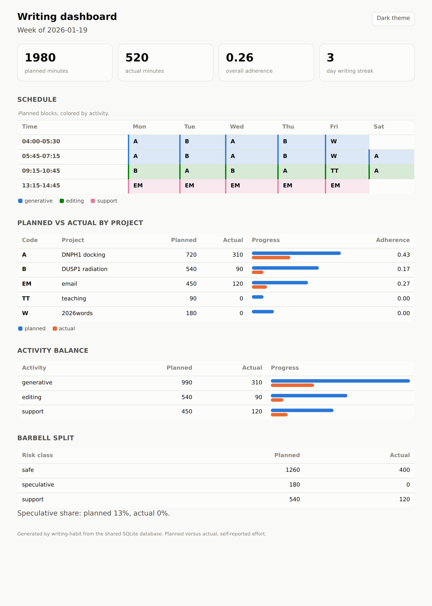

# writing-habit

[](LICENSE)
[](https://www.python.org/)

Track and compare planned versus actual academic writing effort. A companion to [writing-schedule](https://github.com/MooersLab/writing-schedule-py), and the twin of the Emacs Lisp package [writing-habit-el](https://github.com/MooersLab/writing-habit-el).

The toolkit has three modules that share one SQLite database:

- **schedule** turns a weekly plain-text table into a plan (this lives in `writing-schedule`).
- **track** records the effort you actually spent, from a CSV, an ICS calendar, or by hand.
- **compare** reports the gap between plan and performance, as a text report, an optional plot, or a self-contained HTML dashboard.

The database schema in `schema.sql` is the single contract between the modules, so you can substitute other software at any stage. The core needs only the Python standard library. ICS import, plotting, and Google Sheets are optional extras. Because the schema is the contract, the database this package writes is byte-for-byte the same one the Emacs Lisp package writes, so either tool can read what the other recorded, and the two produce byte-identical dashboards.

This is a tool for one person studying and improving their own writing habit, an N-of-1 instrument. It records self-reported effort, not verified focus.

## Screenshots

The weekly HTML dashboard, with a light and a dark theme:



The optional planned-versus-actual chart from the compare stage:


## Install

```
pip install -e .            # core, standard library only
pip install -e '.[ics]'     # add ICS import
pip install -e '.[plot]'    # add the comparison plot
```

Plan import calls the real writing-schedule parser, so the plan and the schedule never diverge. Until writing-schedule is on PyPI, install it from its checkout:

```
pip install -e <path>/writing-schedule-py/writing_schedule
```

The other commands (initdb, track, compare, dashboard) run without it.

## Quick start

```
writing-habit initdb --db habit.db
writing-habit plan import examples/my-week.org --week 2026-01-19 --db habit.db
writing-habit track import examples/actuals.csv --format csv --db habit.db
writing-habit compare --week 2026-01-19 --db habit.db
writing-habit dashboard --week 2026-01-19 --out week.html --db habit.db
```

Add a session by hand at the end of the day:

```
writing-habit track add --day 2026-01-19 --project A --minutes 75 --category generative --db habit.db
```

## Naming and decoding schedule files

Weekly tables can be named by a compact code that encodes the whole week, for example `4gAAeAsA-gWW.org`. Lowercase letters are activities (`g` generative, `e` editing, `s` support), uppercase letters are projects (one letter is one block), and a digit at the start of a group is the count of consecutive days. The full specification is in `docs/table-file-naming-rules.org`.

Decode a code, and optionally check its project letters against a table legend:

```
writing-habit name 4gAAeAsA-gWW
writing-habit name 4gAAeAsA-gWW --table my-week.org
```

With no `--table`, the command looks for `<code>.org` in the current directory. This command needs no database and no third-party package.

## Tracking formats

The CSV template (`tracking-template.csv`) has columns `date, start, end, minutes, project_code, category, note`. Enter either a start and end time or a minutes value. Excel and Google Sheets both export CSV, so no extra dependency is needed.

For calendar tracking, keep actuals in their own ICS calendar. Put the legend code in the event summary in brackets, for example `[A] DNPH1 docking`, and put the activity in the categories field.

## Marking safe and speculative projects

To drive the barbell view, add a risk tag to the end of a legend description in the weekly table, in either the org-tag form `:safe:` or the parenthesis form `(safe)`. Recognized tags are `safe`, `speculative`, and `support`.

```
| A: DNPH1 docking :safe:      |  |  |  |  |  |
| W: 2026words :speculative:   |  |  |  |  |  |
```

Inside a table cell `:safe:` is literal text, because org only reads `:tag:` syntax on headlines, so it does not affect the table or its export. The plan importer strips the tag before storing the description.

## What compare reports

- adherence per project, planned against actual
- the split across the three activities (generative, editing, support)
- the barbell split across safe and speculative work, which is the Rule 6 drift
- the current streak of consecutive writing days

These come three ways: a plain-text report from `compare`, an optional matplotlib bar chart from `compare --plot week.png`, and a self-contained HTML dashboard from `dashboard --out week.html`. The dashboard has two panels, the week's planned schedule as a time-by-day grid colored by activity, and the planned-versus-actual comparison as tiles, per-project meters, the activity balance, and the barbell split. It carries a light and a dark theme and needs no server.

## Interoperability with the Emacs Lisp version

The Emacs Lisp twin, [writing-habit-el](https://github.com/MooersLab/writing-habit-el), shares this schema and the schedule-code specification, so the two interoperate on one database file. A session written by this package reads in the Emacs Lisp package, and the reverse holds too, because neither owns the schema. Both render the same dashboard from the same data, down to the byte. Use whichever fits your workflow, or both on the same database. The Emacs Lisp version adds one capture path this one cannot offer, an org-clock harvest, because Emacs already measures writing time.

## License

MIT.

## Sources of funding

- NIH: R01 CA242845
- NIH: R01 AI088011
- NIH: P30 CA225520 (PI: R. Mannel)
- NIH: P20 GM103640 and P30 GM145423 (PI: A. West)

## Author

Blaine Mooers, Department of Biochemistry and Physiology, University of Oklahoma Health Campus, blaine-mooers@ou.edu.
