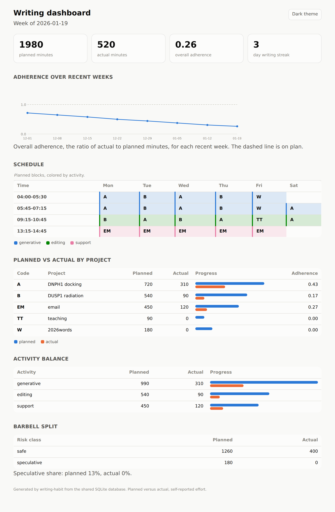
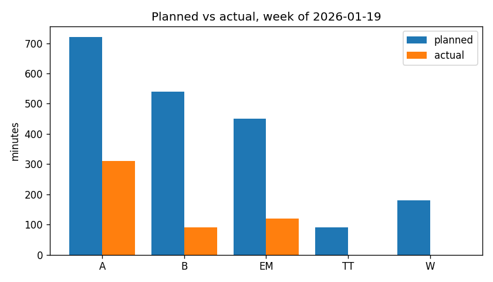
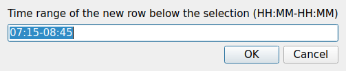
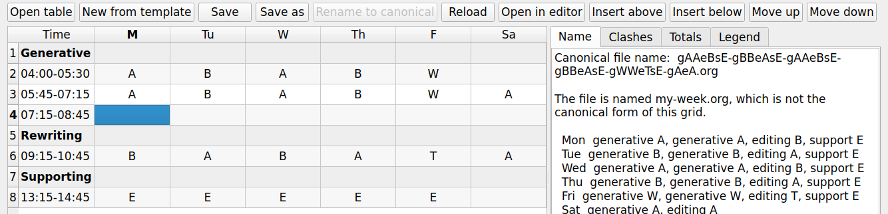
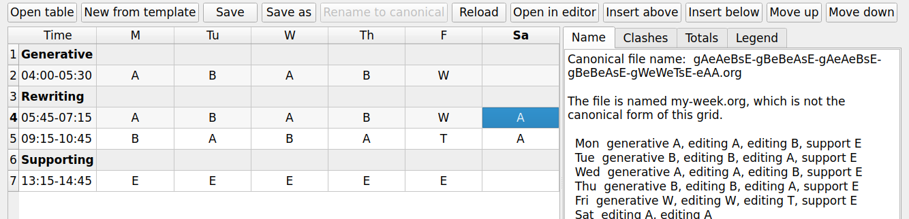
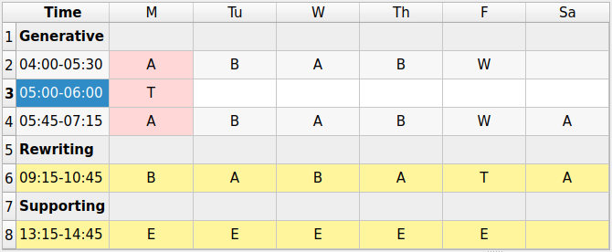
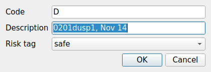
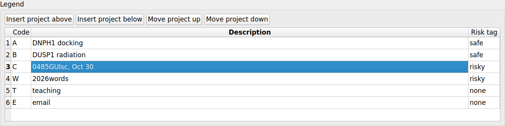
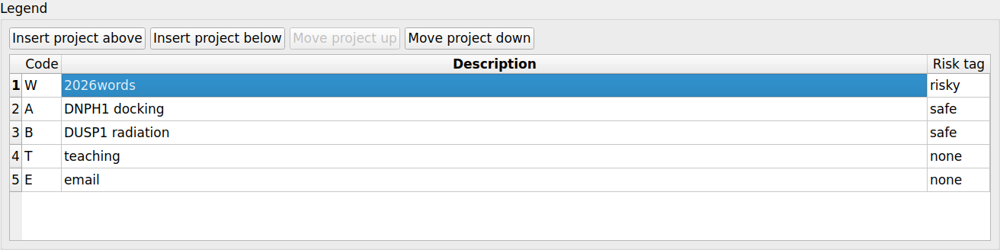
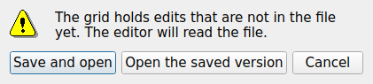

# writing-habit

[](LICENSE)
[](https://www.python.org/)

Track and compare planned versus actual academic writing effort. A companion to [writing-schedule](https://github.com/MooersLab/writing-schedule-py), and the twin of the Emacs Lisp package [writing-habit-el](https://github.com/MooersLab/writing-habit-el).

The toolkit has three modules that share one SQLite database:

- **schedule** turns a weekly plain-text table into a plan (this lives in `writing-schedule`).
- **track** records the effort you actually spent, from a CSV, an ICS calendar, or by hand.
- **compare** reports the gap between plan and performance, as a text report, an optional plot, or a self-contained HTML dashboard.

The database schema in `schema.sql` is the single contract between the modules, so you can substitute other software at any stage. The core needs only the Python standard library. ICS import, plotting, and Google Sheets are optional extras. Because the schema is the contract, the database this package writes is byte-for-byte the same one the Emacs Lisp package writes, so either tool can read what the other recorded, and the two produce byte-identical dashboards.

This is a tool for one person studying and improving their own writing habit, an N-of-1 instrument. It records self-reported effort, not verified focus.

## Screenshots

The weekly HTML dashboard, with a light and a dark theme:



The optional planned-versus-actual chart from the compare stage:



## Install

```
pip install -e .            # core, standard library only
pip install -e '.[ics]'     # add ICS import
pip install -e '.[plot]'    # add the comparison plot
```

Plan import calls the real writing-schedule parser, so the plan and the schedule never diverge. Until writing-schedule is on PyPI, install it from its checkout:

```
pip install -e <path>/writing-schedule-py/writing_schedule
```

The other commands (initdb, track, compare, dashboard) run without it.

## The graphical interface

A point-and-click front end ships as an optional extra. It edits the weekly
block table and runs every subcommand of writing-habit and writing-schedule
through a generated form, showing the equivalent shell command above each run
button.

```
pip install -e '.[gui]'     # the interface, through PyQt5
pip install -e '.[preview]' # optional: a faithful dashboard preview
writing-habit-gui
```

PyQt5 and PyQtWebEngine are distributed under the GPL, while this library and
its command line remain MIT, so installing either extra brings GPL terms with
it. An installation without them is unaffected. See
[docs/gui.md](docs/gui.md) for the tour.

### Editing the weekly table in the Schedule tab

The Schedule tab edits the weekly block table in place. Every change rewrites
only the lines it touches, so a saved table differs from the file on disk only
where you changed it. Six tools make the table easier to build and check.

#### Inserting a time block

Select any cell of a time-block row or a section header and press
**Insert above** or **Insert below**. A dialog asks for the time range of the
new block. It starts with a block of the same length placed flush against the
selected one, so a block inserted below 05:45-07:15 is offered as 07:15-08:45.
Edit the range or accept it.



The new row is empty and selected, so you can type project codes into it at
once. A row inserted below a section header joins that section, and a row
inserted above a header joins the section before it. A range that cannot be
read, or one that ends before it starts, is refused with a message and nothing
changes.



#### Moving a time block up or down

Select any cell of a time-block row and press **Move up** or **Move down**, or
press Alt+Up or Alt+Down while the grid has the focus, which mirrors M-up and
M-down on an org table in Emacs. The row trades places with its neighbour and
stays selected, so pressing the button again keeps moving the same block. Its
times and project codes travel with it unchanged.

A block that moves past a section header joins the neighbouring section. Moving
the last Generative block down puts it at the top of Rewriting, so it now
counts as editing time in the Totals panel and in the tracker. A block cannot
move above the first section header or below the last row, and a section header
does not move, so the buttons turn grey in those cases.

The file line is moved rather than rewritten. A move inside one section
therefore changes the order of two lines in the saved file and nothing else.



#### Finding the times that do not overlap

Click a cell in the Time column. Every row whose time range does not overlap
the selected one turns yellow, across all sections at once. This shows where
else in the day a block could go without a clash. Blocks that only touch, such
as 04:00-05:30 and 05:30-07:00, do not overlap, which is the same rule the
Clashes panel and the scheduler use. A day cell that is red for a clash stays
red inside a yellow row, so the tint never hides a clash. Clicking a day cell
or a section header removes the tint.



#### Inserting a project into the legend

The Legend box below the grid holds the project codes, their descriptions, and
their risk tags. Two buttons above it, **Insert project above** and
**Insert project below**, add a project beside the selected entry. With no
entry selected, a project inserted below goes to the end of the legend and one
inserted above goes to the start.



The dialog offers the first letter that neither the legend nor the grid uses
yet, and it asks for a description and a risk tag of `none`, `safe`, or
`risky`. A code must be a capital letter followed by up to three capitals or
digits. A code the legend already defines is refused, because the readers keep
the first definition of a code and silently drop the second. The new code
appears at once in the list of codes the grid cells offer.



A project you insert stays in the legend even before any cell uses it. The
legend still removes a blank row that it added by itself for a code you typed
into the grid and then deleted, so a typo leaves nothing behind.

#### Moving a project up or down in the legend

Select any cell of a legend entry and press **Move project up** or
**Move project down**, or press Alt+Up or Alt+Down while the legend has the
focus. These are the same keys that move a time block in the grid. The entry
trades places with the one beside it and stays selected, so you can keep
pressing until the projects read in the order you want. A project never leaves
the legend, so the first entry cannot move up and the last cannot move down.

The order matters in one case beyond reading. When a code is defined twice, the
readers keep the first definition, so moving the second one above the first
changes which description and risk tag the tools use. The Legend panel lists
such codes.



#### Opening the table in your own editor

**Open in editor**, to the right of **Reload**, opens the table file in your
text editor. The editor is named by the `WHGEDITOR` variable. The button reads
it from the environment first and then from `~/.bashrc`, because a window
started from the Dock or Finder has not sourced your shell start-up file. The
value may carry arguments.

```
# in ~/.bashrc
export WHGEDITOR="emacsclient -n"
```

When `WHGEDITOR` is not set, the file opens in the system's default text
editor, which is `open -t` on macOS, `xdg-open` on Linux, and the file
association on Windows. A bare program name is also looked for in
`/opt/homebrew/bin`, `/usr/local/bin`, and `/opt/local/bin`, which a window
started from the Dock does not have on its path. A full path always works.

The editor reads the file on disk, so the button checks for unsaved edits
first.



**Save and open** writes your edits and then opens the file.
**Open the saved version** leaves your edits in the grid and opens the file as
it was last saved. After you save in the editor, press **Reload** to bring the
changes back into the grid.

## Quick start

```
writing-habit initdb --db habit.db
writing-habit plan import examples/my-week.org --week 2026-01-19 --db habit.db
writing-habit track import examples/actuals.csv --format csv --db habit.db
writing-habit compare --week 2026-01-19 --db habit.db
writing-habit dashboard --week 2026-01-19 --out week.html --db habit.db
writing-habit history --db habit.db
writing-habit context set --week 2026-01-19 --tag teaching --db habit.db
writing-habit seasons --out seasons.html --db habit.db
```

Add a session by hand at the end of the day:

```
writing-habit track add --day 2026-01-19 --project A --minutes 75 --category generative --db habit.db
```

## Naming and decoding schedule files

Weekly tables can be named by a compact code that encodes the whole week, for example `4gAAeAsA-gWW.org`. Lowercase letters are activities (`g` generative, `e` editing, `s` support), uppercase letters are projects (one letter is one block), and a digit at the start of a group is the count of consecutive days. The full specification is in `docs/table-file-naming-rules.org`.

Decode a code, and optionally check its project letters against a table legend:

```
writing-habit name 4gAAeAsA-gWW
writing-habit name 4gAAeAsA-gWW --table my-week.org
```

With no `--table`, the command looks for `<code>.org` in the current directory. This command needs no database and no third-party package.

## Tracking formats

The CSV template (`tracking-template.csv`) has columns `date, start, end, minutes, project_code, category, note`. Enter either a start and end time or a minutes value. Excel and Google Sheets both export CSV, so no extra dependency is needed.

For calendar tracking, keep actuals in their own ICS calendar. Put the legend code in the event summary in brackets, for example `[A] DNPH1 docking`, and put the activity in the categories field.

## Marking safe and speculative projects

To drive the barbell view, add a risk tag to the end of a legend description in the weekly table, in either the org-tag form `:safe:` or the parenthesis form `(safe)`. The two tags are `:safe:` and `:risky:`, and `:risky:` names the class the database calls `speculative`. Support is an activity category, not a risk class, so a support project carries no risk tag.

```
| A: DNPH1 docking :safe:      |  |  |  |  |  |
| W: 2026words :risky:   |  |  |  |  |  |
```

Inside a table cell `:safe:` is literal text, because org only reads `:tag:` syntax on headlines, so it does not affect the table or its export. The plan importer strips the tag before storing the description.

## What compare reports

- adherence per project, planned against actual
- the split across the three activities (generative, editing, support)
- the barbell split across safe and speculative work, which is the Rule 6 drift
- the current streak of consecutive writing days

These come three ways: a plain-text report from `compare`, an optional matplotlib bar chart from `compare --plot week.png`, and a self-contained HTML dashboard from `dashboard --out week.html`. The dashboard has two panels, the week's planned schedule as a time-by-day grid colored by activity, and the planned-versus-actual comparison as tiles, per-project meters, the activity balance, and the barbell split. It carries a light and a dark theme and needs no server.

## Tracking adherence over time

Beyond a single week, `history` prints the weekly adherence series and, with `--plot`, writes five plots by week: overall adherence, the mean of the per-project ratios, and the mean adherence within each of the three activities.

`context` tags a week with an event, for example a national meeting, a teaching block, or a data-collection push, so the weeks can be grouped by what kind of period they were.

`seasons` writes a second self-contained HTML dashboard that groups adherence three ways: by calendar month for seasonal trends, by event-context tag, and by the schedule file-name code so plan shapes can be compared. The schedule code is captured at plan import from the table file name.

```
writing-habit history --db habit.db --from 2026-01-01 --to 2026-06-30 --plot trend.png
writing-habit context set --week 2026-02-02 --tag teaching --db habit.db
writing-habit seasons --out seasons.html --db habit.db
```

## Interoperability with the Emacs Lisp version

The Emacs Lisp twin, [writing-habit-el](https://github.com/MooersLab/writing-habit-el), shares this schema and the schedule-code specification, so the two interoperate on one database file. A session written by this package reads in the Emacs Lisp package, and the reverse holds too, because neither owns the schema. Both render the same dashboard from the same data, down to the byte. Use whichever fits your workflow, or both on the same database. The Emacs Lisp version adds one capture path this one cannot offer, an org-clock harvest, because Emacs already measures writing time.

## License

MIT.

## Sources of funding

- NIH: R01 CA242845
- NIH: R01 AI088011
- NIH: P30 CA225520 (PI: R. Mannel)
- NIH: P20 GM103640 and P30 GM145423 (PI: A. West)

## Author

Blaine Mooers, Department of Biochemistry and Physiology, University of Oklahoma Health Campus, blaine-mooers@ou.edu.
