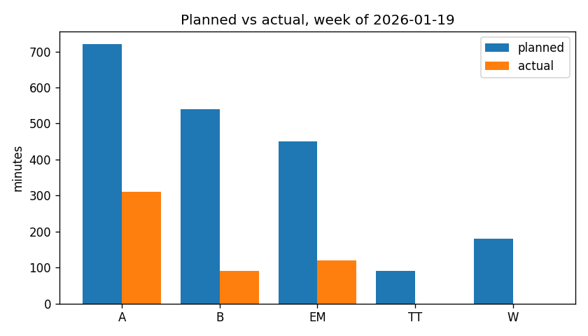
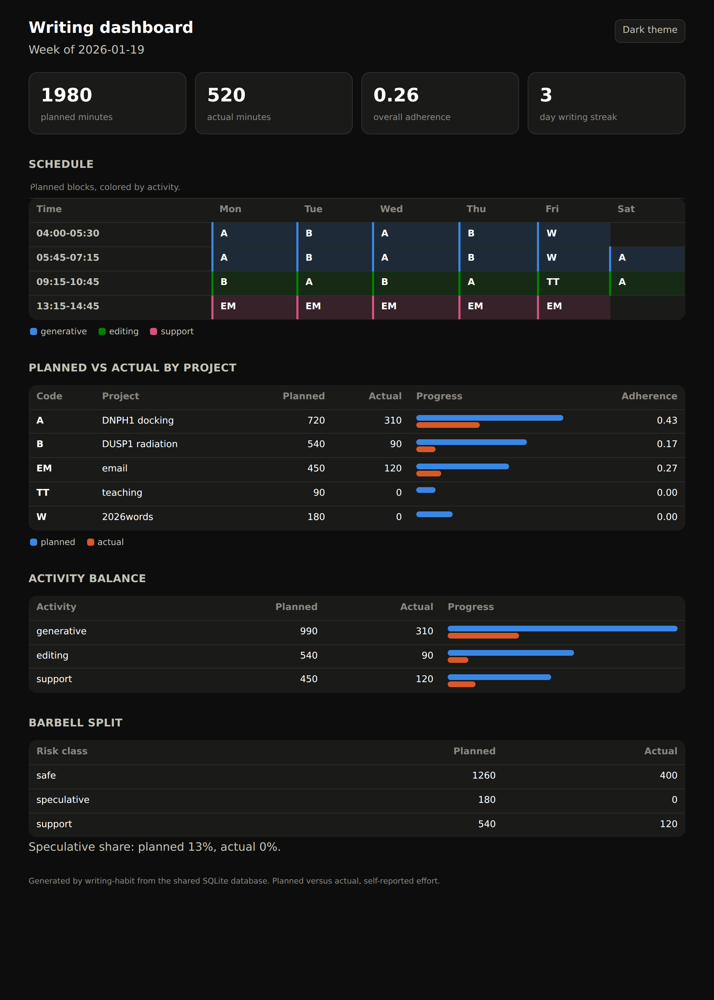

# Dashboard and reports

The compare stage turns the plan-performance gap into numbers a writer can act
on, and it presents them three ways. The plain-text report is the quickest
read. The optional bar chart is a single image. The HTML dashboard is the
fullest view, and it is the shared rendering that the Emacs Lisp twin also
produces. All three read the same four views, so they always agree.

## The four measurements

Each output is built from the same four measurements, one per view in the
[data model](data-model.md).

The per-project adherence is the actual minutes over the planned minutes for
each project, which shows where intention and effort diverged. The activity
balance is the split across generative, editing, and support, which shows
whether the week drifted away from generative writing toward easier editing or
support. The barbell split is the split across safe and speculative work, which
shows whether the speculative slot was starved. The streak is the run of days
with any writing at all, which is the visible signal to keep.

## The text report

`writing-habit compare --week DATE --db DB` prints the report. It totals the
week, breaks it down by project, by activity, and by barbell class, draws a
small text meter of actual against planned, and closes with the streak. It is
the one output that needs nothing beyond the core install.

## The optional plot

`writing-habit compare --week DATE --db DB --plot week.png` also writes a
grouped bar chart of planned against actual minutes per project. This needs the
`plot` extra, which pulls in `matplotlib`.

## The HTML dashboard

`writing-habit dashboard --week DATE --out week.html --db DB` writes a
self-contained page. It embeds its own style and script, so it opens in any
browser with no server and no network request. The page has four sections below
the summary tiles, namely the week's schedule redrawn as a time-by-day grid
colored by activity, the planned-versus-actual comparison by project with a
two-bar meter and an adherence column, the activity balance, and the barbell
split with the speculative share.

A button in the top corner switches between a light theme and a dark theme, and
the page also honors the reader's system preference through a
`prefers-color-scheme` media query.

The colors follow a data-viz palette in which the three activities take blue,
green, and magenta, and the planned and actual marks take blue and orange,
which sit far apart for colorblind readers. Every value appears as a direct
label in ink, never by color alone, and the schedule is a labeled table, so the
page reads without relying on color.

## Why the dashboard and the report can disagree by a point

The text report and the dashboard round a percentage differently, so the
speculative share can read as 12 percent in the text report and 13 percent on
the dashboard for the same week. The dashboard rounds half up, so a share of
12.5 percent becomes 13, and it does this to stay byte-identical to the Emacs
Lisp twin. Both figures describe the same underlying minutes, so the one-point
gap is a rounding choice rather than a disagreement about the data.

## Byte-identical to the Emacs Lisp twin

The dashboard markup is built deterministically from the shared database, and
the static style and script blocks are the same text both ports carry, so the
Python package and the Emacs Lisp twin render one identical file from the same
data. A frozen render is committed at `tests/fixtures/dashboard.html`, and both
test suites assert against it from the shared `tests/fixtures/cross-port.db`, so
neither port can drift into a dialect of its own.
