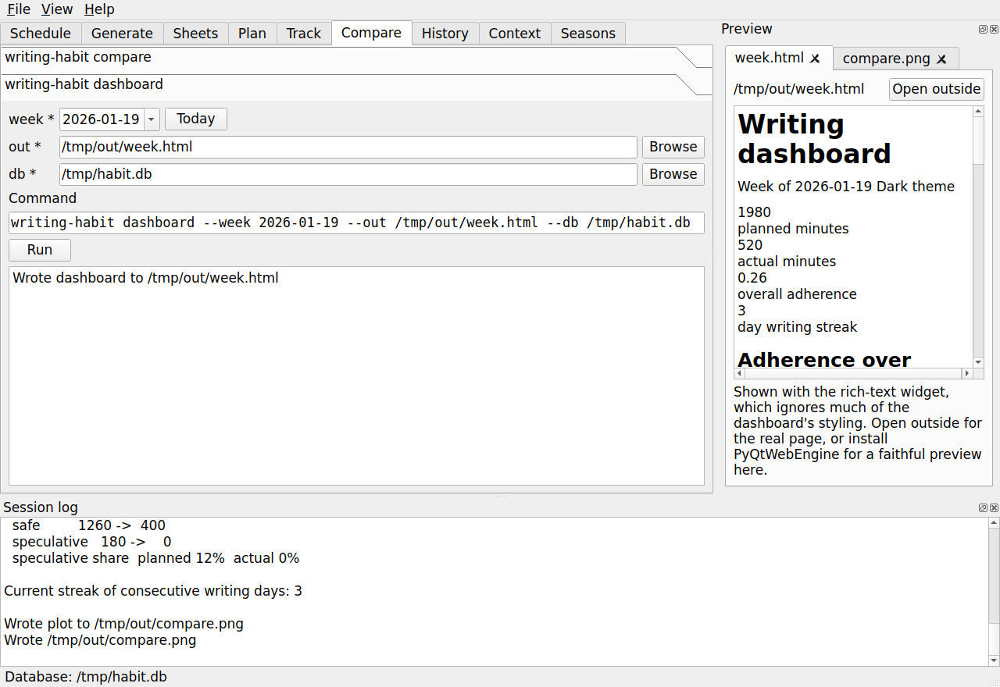
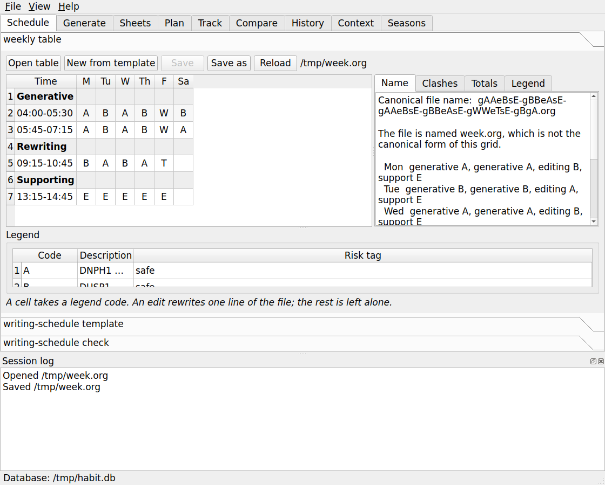

# The graphical interface

`writing-habit-gui` is a point-and-click front end for this package and for its
companion `writing-schedule`. It edits the weekly block table, and it runs every
subcommand of both programs through a form rather than a typed line.

The interface adds no behaviour of its own. Every form is generated by reading
the same `argparse` parser the command line uses, every run calls the same
`main` function, and the command that will run is shown above the run button, so
the interface teaches the command line rather than replacing it.



## Installing it

The graphical layer is an optional extra, so the library and the command line
stay free of a Qt dependency.

```
pip install 'writing-habit[gui]'
```

The extra installs PyQt5 and `writing-schedule`. **PyQt5 is distributed under
the GPL**, while the library and the command line remain MIT, so installing this
extra brings GPL terms with it. An installation without the extra is unaffected.

One further extra is optional even here:

```
pip install 'writing-habit[preview]'
```

That adds `PyQtWebEngine`, which renders the two HTML dashboards faithfully in
the preview dock. Without it the dock shows them with the rich-text widget of
Qt, which ignores much of their styling, and every preview offers **Open
outside** to open the real page in your browser. The web engine is a large
dependency for a convenience, so it is deliberately not part of `gui`.

Start the interface with:

```
writing-habit-gui
```

If PyQt5 is missing, the command prints one line naming the extra to install
rather than a traceback.

## The window

The tabs follow the weekly loop, from editing the table through generating the
schedule to comparing the week you planned with the week you had.

| Tab | What it holds | Program |
|-----|---------------|---------|
| Schedule | the weekly table editor, and the `template` and `check` forms | `writing-schedule` |
| Generate | `generate`, `export`, and `weeks` | `writing-schedule` |
| Sheets | `sheets` | `writing-schedule` |
| Plan | `initdb` and `plan import` | `writing-habit` |
| Track | `track import` and `track add` | `writing-habit` |
| Compare | `compare` and `dashboard` | `writing-habit` |
| History | `history` | `writing-habit` |
| Context | `context set`, `clear`, and `list` | `writing-habit` |
| Seasons | `seasons` and `name` | `writing-habit` |

Two docks sit below and beside the tabs. The **session log** records every
command that ran and everything it printed, so you can copy a line and paste it
into a terminal. The **preview** dock appears the first time a command writes a
file. Both are toggled from the View menu.

The status bar names the database the last command used, so a run against the
wrong file is visible at once. When `writing-schedule` is not installed, the
status bar says so and the three scheduler tabs explain how to add it.

## Running a command

Each form carries one widget per option, chosen from the option itself. A flag
becomes a check box, a choice becomes a drop-down, a date becomes a calendar
field with a **Today** button, and a path becomes a line edit with a chooser. An
optional date, time, or count carries a small **send** box that decides whether
the option is passed at all, because those widgets always show a value.

The **Command** line above the run button shows exactly what will run. The run
button stays disabled while a required value is missing, and the reason is named
beside it. Output appears in the pane below and in the session log.

Every form keeps its own `--db` widget, matching the command line, where `--db`
is required on each subcommand that touches the database. The path you last used
seeds every form, so a weekly loop of `plan import`, `compare`, and `dashboard`
needs no retyping.

## Editing the weekly table

The Schedule tab shows the table as you laid it out. Rows are the section
headers and the time blocks in file order, and columns are the days named by the
header row, so a six-day table and a seven-day table both work.



A cell takes a project code from a drop-down of the legend codes. The box is
editable, so you can type a new code and add its legend row afterwards. Section
rows and the time column refuse edits, because they belong to the file rather
than to the week. The legend table below the grid edits the code, the
description, and the risk tag, which is one of `none`, `safe`, and `risky`.

**Every edit rewrites one line of the file.** A value that fits its column keeps
the table aligned; a longer value widens its own slot and leaves the rest alone,
so you realign in Emacs with `C-c C-c` when you want to. A table you open and do
not change saves byte for byte.

Four panels report on the week as you edit it.

| Panel | What it answers |
|-------|-----------------|
| Name | the canonical file name for this grid, the week its code decodes to, and whether the file on disk is named differently |
| Clashes | the overlapping blocks, with the count in the tab label and the offending cells tinted |
| Totals | planned minutes by day, by project, and by activity, and any section header that maps to no activity |
| Legend | every project letter resolved against the legend, unused legend entries, codes defined twice, and risk tags that name no class |

The toolbar holds **Open table**, **New from template**, which asks for a
project count and calls the scheduler's own scaffold, **Save**, **Save as**,
which offers the canonical name, **Rename to canonical**, and **Reload**.

Renaming is worth its button. The tracker groups weeks by the schedule code
captured at plan import, and that code comes from the file name, so a table
whose name has drifted from its grid is filed under the wrong plan shape and the
seasons dashboard then groups it with the wrong weeks. The button offers itself
only when the file is saved and misnamed, and it refuses to overwrite a
different file.

A week has no canonical name when a cell holds a project code of more than one
letter, because a file name gives one letter to one block. The Name panel says
which code is at fault, and the naming rules answer it with a single-letter
alias kept beside the full code in the legend.

## Seeing what a command wrote

The preview dock keeps one tab per recent file.

| Output | How it is shown |
|--------|-----------------|
| The weekly dashboard and the seasons page | rendered, faithfully with the `preview` extra and roughly without it |
| The `compare` and `history` plots | as the image, with its pixel size |
| The schedule `.org`, the `.ics`, and the sheet `.org` or `.tex` | as text |
| The sheet PDFs | by name, because Qt has no PDF viewer here |

Every tab offers **Open outside**, which hands the file to the program your
desktop uses. That is the honest answer for the dashboards, and the only one for
a PDF.

## Testing and troubleshooting

The graphical tests run without a display:

```
make test
```

The Makefile exports `QT_QPA_PLATFORM=offscreen` for that reason. A checkout
without the extra skips the graphical tests rather than failing them.

| Symptom | Cause and cure |
|---------|----------------|
| `writing-habit-gui` prints an install hint | PyQt5 is missing; `pip install 'writing-habit[gui]'` |
| The Generate and Sheets tabs show an install note | `writing-schedule` is missing; the `gui` extra installs it, or install a checkout in editable mode |
| A dashboard preview looks unstyled | the `preview` extra is not installed; use **Open outside**, or add `PyQtWebEngine` |
| `plan import` reports a missing package | the same `writing-schedule` dependency, reported in the output pane rather than as a traceback |

## Licensing

The library, the command line, and this documentation are under the MIT license.
The `gui` extra installs PyQt5, and the `preview` extra installs PyQtWebEngine,
both of which are distributed under the GPL. Installing either extra therefore
brings GPL terms into your environment. The About dialog of the interface states
the same split.
