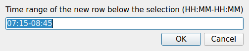
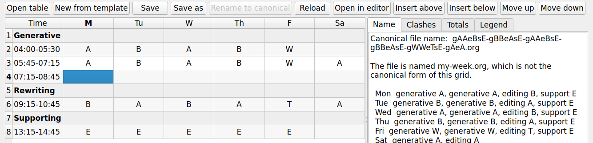
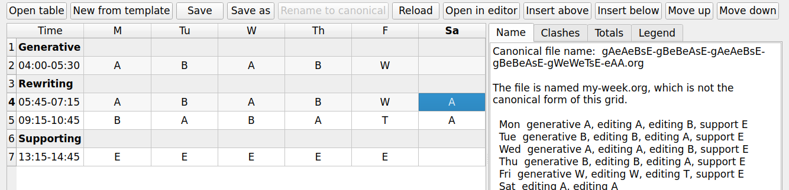
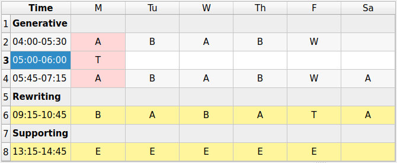
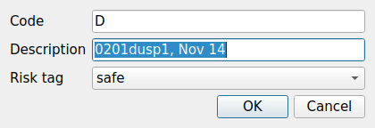
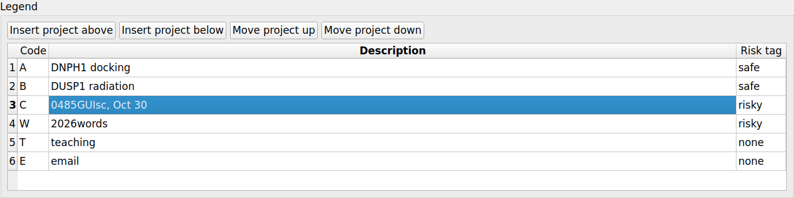
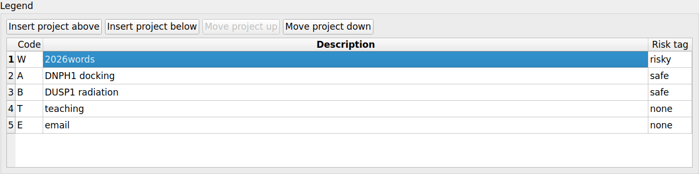
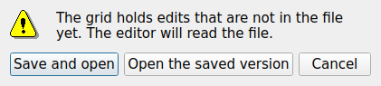

# The graphical interface

`writing-habit-gui` is a point-and-click front end for this package and for its
companion `writing-schedule`. It edits the weekly block table, and it runs every
subcommand of both programs through a form rather than a typed line.

The interface adds no behaviour of its own. Every form is generated by reading
the same `argparse` parser the command line uses, every run calls the same
`main` function, and the command that will run is shown above the run button, so
the interface teaches the command line rather than replacing it.


## Installing it

The graphical layer is an optional extra, so the library and the command line
stay free of a Qt dependency.

```
pip install 'writing-habit[gui]'
```

The extra installs PyQt5 and `writing-schedule`. **PyQt5 is distributed under
the GPL**, while the library and the command line remain MIT, so installing this
extra brings GPL terms with it. An installation without the extra is unaffected.

One further extra is optional even here:

```
pip install 'writing-habit[preview]'
```

That adds `PyQtWebEngine`, which renders the two HTML dashboards faithfully in
the preview dock. Without it the dock shows them with the rich-text widget of
Qt, which ignores much of their styling, and every preview offers **Open
outside** to open the real page in your browser. The web engine is a large
dependency for a convenience, so it is deliberately not part of `gui`.

Start the interface with:

```
writing-habit-gui
```

If PyQt5 is missing, the command prints one line naming the extra to install
rather than a traceback.

## The window

The tabs follow the weekly loop, from editing the table through generating the
schedule to comparing the week you planned with the week you had.

| Tab | What it holds | Program |
|-----|---------------|---------|
| Schedule | the weekly table editor, and the `template` and `check` forms | `writing-schedule` |
| Generate | `generate`, `export`, and `weeks` | `writing-schedule` |
| Sheets | `sheets` | `writing-schedule` |
| Plan | `initdb` and `plan import` | `writing-habit` |
| Track | `track import` and `track add` | `writing-habit` |
| Compare | `compare` and `dashboard` | `writing-habit` |
| History | `history` | `writing-habit` |
| Context | `context set`, `clear`, and `list` | `writing-habit` |
| Seasons | `seasons` and `name` | `writing-habit` |

Two docks sit below and beside the tabs. The **session log** records every
command that ran and everything it printed, so you can copy a line and paste it
into a terminal. The **preview** dock appears the first time a command writes a
file. Both are toggled from the View menu.

The status bar names the database the last command used, so a run against the
wrong file is visible at once. Its right end holds three buttons.
**Documentation** opens this page in your web browser, **README** opens the
README of the repository on GitHub, and **Quit** closes the window. The Help
menu offers the same two pages. When `writing-schedule` is not installed, the
status bar says so and the three scheduler tabs explain how to add it.

## Running a command

Each form carries one widget per option, chosen from the option itself. A flag
becomes a check box, a choice becomes a drop-down, a date becomes a calendar
field with a **Today** button, and a path becomes a line edit with a chooser. An
optional date, time, or count carries a small **send** box that decides whether
the option is passed at all, because those widgets always show a value.

The **Command** line above the run button shows exactly what will run. The run
button stays disabled while a required value is missing, and the reason is named
beside it. Output appears in the pane below and in the session log.

Every form keeps its own `--db` widget, matching the command line, where `--db`
is required on each subcommand that touches the database. The path you last used
seeds every form, so a weekly loop of `plan import`, `compare`, and `dashboard`
needs no retyping.

## Editing the weekly table

The Schedule tab shows the table as you laid it out. Rows are the section
headers and the time blocks in file order, and columns are the days named by the
header row, so a six-day table and a seven-day table both work.


A cell takes a project code from a drop-down of the legend codes. The box is
editable, so you can type a new code, and the legend gains a blank row for it at
once. Section rows and the time column refuse edits, because they belong to the
file rather than to the week. Clicking a time does something else, which
[Finding the times that do not overlap](#finding-the-times-that-do-not-overlap)
describes. The legend table below the grid edits the code, the description, and
the risk tag, which is one of `none`, `safe`, and `risky`. Four buttons above
the legend insert a project or move the selected one, as described below.

**Every edit rewrites one line of the file.** A value that fits its column keeps
the table aligned; a longer value widens its own slot and leaves the rest alone,
so you realign in Emacs with `C-c C-c` when you want to. A table you open and do
not change saves byte for byte.

Four panels report on the week as you edit it.

| Panel | What it answers |
|-------|-----------------|
| Name | the canonical file name for this grid, the week its code decodes to, and whether the file on disk is named differently |
| Clashes | the overlapping blocks, with the count in the tab label and the offending cells tinted |
| Totals | planned minutes by day, by project, and by activity, and any section header that maps to no activity |
| Legend | every project letter resolved against the legend, unused legend entries, codes defined twice, and risk tags that name no class |

The toolbar holds **Open table**, **New from template**, which asks for a
project count and calls the scheduler's own scaffold, **Save**, **Save as**,
which offers the canonical name, **Rename to canonical**, **Reload**,
**Open in editor**, **Insert above**, **Insert below**, **Move up**, and
**Move down**. The last five are described below. The file name at the end of the toolbar shrinks when the
window is narrow, and its tooltip gives the full path.

Renaming is worth its button. The tracker groups weeks by the schedule code
captured at plan import, and that code comes from the file name, so a table
whose name has drifted from its grid is filed under the wrong plan shape and the
seasons dashboard then groups it with the wrong weeks. The button offers itself
only when the file is saved and misnamed, and it refuses to overwrite a
different file.

A week has no canonical name when a cell holds a project code of more than one
letter, because a file name gives one letter to one block. The Name panel says
which code is at fault, and the naming rules answer it with a single-letter
alias kept beside the full code in the legend.

### Inserting a time block

Select any cell of a time-block row or a section header and press
**Insert above** or **Insert below**. Both buttons stay disabled until a cell is
selected. A dialog asks for the time range of the new block. It starts with a
block of the same length placed flush against the selected one, so a block
inserted below 05:45-07:15 is offered as 07:15-08:45. Beside a section header
the nearest block of the neighbouring section serves as the model. Edit the
range or accept it.



The new row is empty and selected, so you can type project codes into it at
once. It copies the column widths of the row beside it, and it copies how that
row pads its time, so a table whose Time column is padded on the left stays
that way. Saving adds exactly one line to the file.



The section a row belongs to follows from where it lands, which is how the
scheduler reads the file.

| Where you insert | The new block belongs to |
|------------------|--------------------------|
| above or below a time block | that block's section |
| below a section header | that header's section |
| above a section header | the section before the header |

A range that cannot be read, or one that ends before it starts, is refused with
a message and nothing changes. The time of a row cannot be edited in the grid,
so fix a wrong time in your own editor, as described under
[Opening the table in your own editor](#opening-the-table-in-your-own-editor).

### Moving a time block up or down

Select any cell of a time-block row and press **Move up** or **Move down**. The
same moves are on the keyboard as Alt+Up and Alt+Down while the grid has the
focus, which mirrors `M-<up>` and `M-<down>` on an org table in Emacs. The row
trades places with the grid row beside it and stays selected in the same
column, so pressing the button again keeps moving the same block. Its times and
project codes travel with it unchanged, and the yellow tint, when it is shown,
follows the row.



A section header is a grid row too, so a block can move from one section into
the next. The section decides the activity the block counts toward in the
Totals panel and in the tracker, and the log says so when a move changes it,
for example `Moved the 05:45-07:15 block down into Rewriting`.

| What the block passes | Where it lands |
|-----------------------|----------------|
| another time block | the same section, one row higher or lower |
| the header of the section below | the top of that section |
| the header of its own section | the bottom of the section above |

A block cannot move above the first section header, because a row there belongs
to no section, and it cannot move past the top or the bottom of the grid.
Section headers and legend rows do not move. The buttons turn grey in each of
these cases, so their state tells you what a press would do.

The line is moved in the file, not rewritten. A move inside one section swaps
two lines of the saved file, and a move up undoes a move down byte for byte.

### Finding the times that do not overlap

Click a cell in the Time column. Every row whose time range does not overlap
the selected one turns yellow, across all sections at once. This shows where
else in the day a block could go without a clash, which the grid cannot show on
its own because the blocks of different sections share one clock.



The rule is the one the Clashes panel and the scheduler use. Each range runs
from its start up to, but not including, its end, so blocks that only touch,
such as 04:00-05:30 and 05:30-07:00, do not overlap. A range whose end is not
after its start runs past midnight. The selected row itself is never tinted.

A day cell that is red for a clash stays red inside a yellow row, because the
clash is the more urgent thing to see. Clicking a day cell or a section header
removes the tint, and so does opening another table. Hovering over a yellow
time says that it does not overlap the selected one.

### Inserting a project into the legend

Two buttons above the legend table, **Insert project above** and
**Insert project below**, add a project beside the selected entry. They are
enabled as soon as a table is open. With no entry selected, a project inserted
below goes to the end of the legend and one inserted above goes to the start.



The dialog asks for three things.

Code
: A capital letter followed by up to three capitals or digits. The field starts
  with the first letter that neither the legend nor the grid uses yet.

Description
: The project name, optionally followed by a due date such as `Sept 25`, which
  the cell tooltips read.

Risk tag
: One of `none`, `safe`, and `risky`.

A lowercase code is raised to capitals. A code the legend already defines is
refused, because the readers keep the first definition of a code and silently
drop the second. The new entry is selected on its description, and its code
appears at once in the drop-down of every grid cell.



A project you insert stays in the legend even before any cell uses it. The
legend removes only the blank rows it added by itself, for a code you typed into
a cell and then deleted, so a typo leaves nothing behind. A blank project read
from the file is kept too. A blank entry is written as `C:`, which both this
editor and the scheduler read as a legend row rather than as a section header.

### Moving a project up or down in the legend

Two more buttons above the legend table, **Move project up** and
**Move project down**, shift the selected entry by one row. Alt+Up and Alt+Down
do the same while the legend has the focus. Each pair of keys belongs to its
own table, so the keys move a time block when the grid has the focus and a
project when the legend has it. The entry stays selected in the same column, so
pressing again keeps moving the same project.



A project trades places with the legend entry beside it, so it never leaves the
legend and never passes a row of the grid. The first entry cannot move up and
the last cannot move down, and the matching button turns grey. Moving a project
changes nothing in the grid, the totals, or the canonical name.

The order is not only cosmetic. When a code is defined twice, both the editor
and the scheduler keep the first definition, so moving the second definition
above the first changes which description and risk tag the tools use. The
Legend panel lists any code defined more than once, so you can see which one
now wins.

As with a block, the line is moved rather than rewritten. A move swaps two lines
of the saved file, and a move up undoes a move down byte for byte.

### Opening the table in your own editor

**Open in editor**, to the right of **Reload**, opens the table file in your
text editor. It is enabled once the table has been saved to a file. The editor
is named by the `WHGEDITOR` variable, which may carry arguments.

```
# in ~/.bashrc
export WHGEDITOR="emacsclient -n"
```

The button looks for the editor in this order.

| Order | Where it looks |
|-------|----------------|
| 1 | `WHGEDITOR` in the environment of the running interface |
| 2 | the last `WHGEDITOR=` line of `~/.bashrc`, with quotes, a trailing comment, and `$HOME` handled |
| 3 | the system's default text editor, which is `open -t` on macOS, `xdg-open` on Linux, and the file association on Windows |

The second step exists because a window started from the Dock or Finder has not
sourced your shell start-up file. For the same reason, a bare program name is
also looked for in `/opt/homebrew/bin`, `/usr/local/bin`, and `/opt/local/bin`,
which such a window does not have on its path. A full path always works. The
editor runs on its own, so closing the interface does not close it.

The editor reads the file on disk, so the button checks for unsaved edits
first.



**Save and open** writes your edits and then opens the file.
**Open the saved version** leaves your edits in the grid and opens the file as
it was last saved. **Cancel** opens nothing. The session log records the command
that started the editor. After you save in the editor, press **Reload** to bring
the changes back into the grid.

## Seeing what a command wrote

The preview dock keeps one tab per recent file.

| Output | How it is shown |
|--------|-----------------|
| The weekly dashboard and the seasons page | rendered, faithfully with the `preview` extra and roughly without it |
| The `compare` and `history` plots | as the image, with its pixel size |
| The schedule `.org`, the `.ics`, and the sheet `.org` or `.tex` | as text |
| The sheet PDFs | by name, because Qt has no PDF viewer here |

Every tab offers **Open outside**, which hands the file to the program your
desktop uses. That is the honest answer for the dashboards, and the only one for
a PDF.

## Testing and troubleshooting

The graphical tests run without a display:

```
make test
```

The Makefile exports `QT_QPA_PLATFORM=offscreen` for that reason. A checkout
without the extra skips the graphical tests rather than failing them.

| Symptom | Cause and cure |
|---------|----------------|
| `writing-habit-gui` prints an install hint | PyQt5 is missing; `pip install 'writing-habit[gui]'` |
| The Generate and Sheets tabs show an install note | `writing-schedule` is missing; the `gui` extra installs it, or install a checkout in editable mode |
| A dashboard preview looks unstyled | the `preview` extra is not installed; use **Open outside**, or add `PyQtWebEngine` |
| `plan import` reports a missing package | the same `writing-schedule` dependency, reported in the output pane rather than as a traceback |
| **Open in editor** reports that the editor could not start | the program in `WHGEDITOR` is not on the path the window sees; give its full path, such as `/opt/homebrew/bin/emacsclient -n` |
| **Open in editor** opens the wrong program | `WHGEDITOR` is unset, so the system default for `.org` files opened; set `WHGEDITOR` in `~/.bashrc` |
| An edit made in your editor does not show in the grid | the grid does not watch the file; press **Reload** |
| **Insert above** and **Insert below** are greyed out | no grid cell is selected; click any cell of a time block or a section header |
| **Move up** and **Move down** are both greyed out | the selection is a section header, or no cell is selected; click a cell of a time block |
| **Move up** alone is greyed out | the block is the first row under the first section header, so it has nowhere above to go |
| Alt+Up or Alt+Down does nothing | neither the grid nor the legend has the focus; click a cell of the table you want to reorder first |
| **Move project up** and **Move project down** are both greyed out | no legend entry is selected; click any cell of a legend row |

## Licensing

The library, the command line, and this documentation are under the MIT license.
The `gui` extra installs PyQt5, and the `preview` extra installs PyQtWebEngine,
both of which are distributed under the GPL. Installing either extra therefore
brings GPL terms into your environment. The About dialog of the interface states
the same split.
