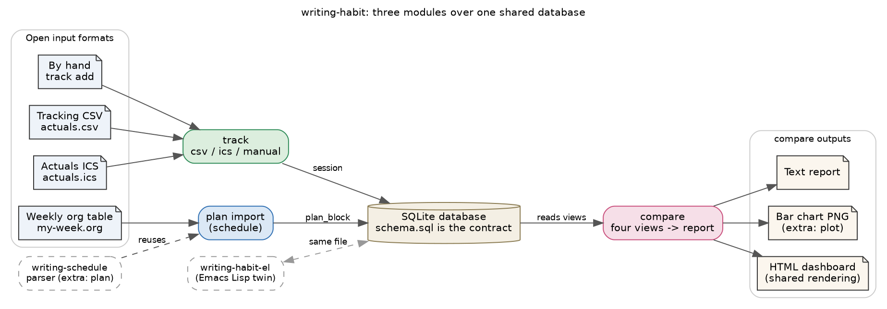

# writing-habit

`writing-habit` records the writing effort you actually spend and compares it
against the week you planned. It is a companion to
[writing-schedule](https://writing-schedule-py.readthedocs.io/), and it is the
twin of the Emacs Lisp package
[writing-habit-el](https://github.com/MooersLab/writing-habit-el). It is an
N-of-1 instrument for one person studying and improving a private writing
habit, so it records self-reported effort rather than verified focus.

The toolkit has three modules that share one SQLite database. The **schedule**
module turns a weekly plain-text table into a plan, and it reuses the
`writing-schedule` parser so the plan and the schedule never diverge. The
**track** module records the sessions you actually worked, from a CSV, from an
ICS calendar, or by hand. The **compare** module reports the gap between plan
and performance as a text report, an optional plot, or a self-contained HTML
dashboard.



The database schema in `schema.sql` is the single contract between the modules,
so you can substitute other software at any stage. The core needs only the
Python standard library. ICS import, plotting, and Google Sheets are optional
extras. Because the schema is the contract, the database this package writes is
the same one the Emacs Lisp twin writes, so either tool reads what the other
recorded, and the two render one byte-identical dashboard from the same data.

```{toctree}
:maxdepth: 2
:caption: User guide

installation
tutorial
data-model
tracking-formats
schedule-codes
cli
library
dashboard
```

```{toctree}
:maxdepth: 2
:caption: Reference

api
development
```

## A one-minute example

```
pip install -e .
writing-habit initdb   --db habit.db
writing-habit plan import examples/my-week.org --week 2026-01-19 --db habit.db
writing-habit track import examples/actuals.csv --format csv --db habit.db
writing-habit compare  --week 2026-01-19 --db habit.db
writing-habit dashboard --week 2026-01-19 --out week.html --db habit.db
```

The first command seeds an empty database, the `plan import` command fills the
planned blocks for the week, the `track import` command loads the sessions you
worked, and the last two commands report the gap as text and as a web page you
open in any browser.
