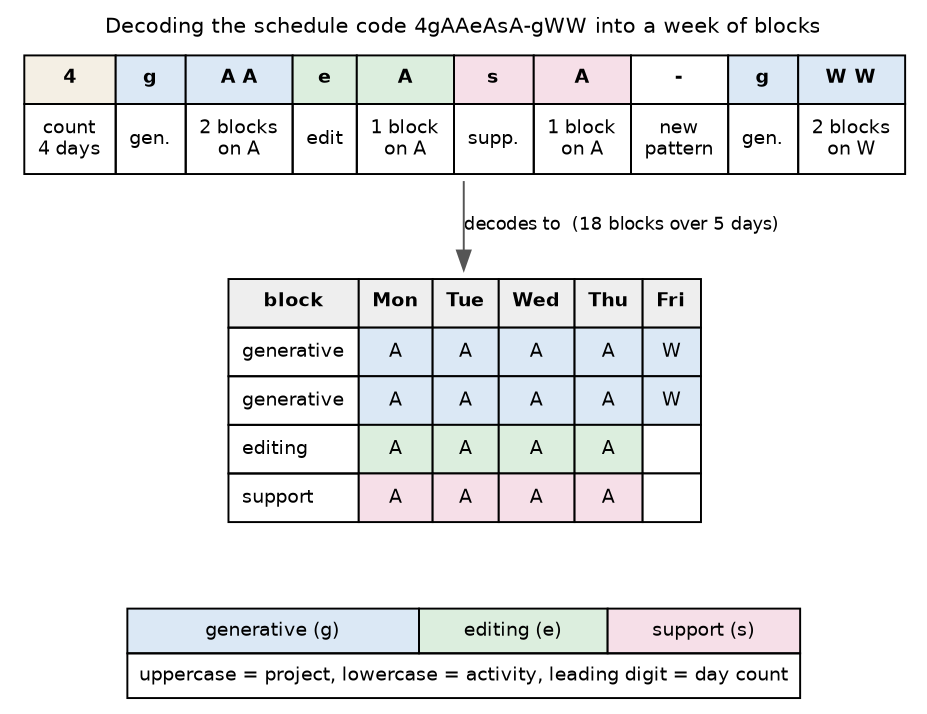

# Schedule codes and the name command

A weekly table can be named by a compact code that encodes the whole week, for
example `4gAAeAsA-gWW.org`. A folder of schedules named this way is
self-documenting and sorts sensibly. The `name` command decodes a code and
checks its project letters against a table legend. It needs no database and no
third-party package. The full specification lives in
`docs/table-file-naming-rules.org`, and this page is the working summary.

## The alphabet

The code uses three character classes that never overlap, so a day needs no
separators inside it. Lowercase letters name activities, namely `g` for
generative, `e` for editing, and `s` for support. Uppercase letters name
projects, and one uppercase letter is one block on that project. A digit at the
start of a group is the count of consecutive days that share the pattern. A
hyphen marks the boundary where the daily pattern changes. A lone `o` is an
open day that carries no blocks.

## How to read a code

Split the code on hyphens into day-groups, then read the groups in order onto
the week starting at Monday. A day-group is an optional leading count followed
by a day-pattern, and the count defaults to one. A day-pattern is a sequence of
activity runs, where each run opens with an activity letter and is followed by
one project letter per block. Order the blocks within a day by time of day,
generative first by convention, then editing, then support.



The figure decodes `4gAAeAsA-gWW`. The leading `4` sets Monday through Thursday
to the pattern `gAAeAsA`, which is two generative blocks on A, one editing block
on A, and one support block on A. After the hyphen, `gWW` sets Friday to two
generative blocks on W. Days beyond the last group are open by default, so the
week ends on Friday without a trailing `o`.

## Decode a code

```
writing-habit name 4gAAeAsA-gWW
```

The command prints the week day by day, then a summary of the blocks by
activity and by project:

```
Schedule 4gAAeAsA-gWW
  Mon  generative A, generative A, editing A, support A
  Tue  generative A, generative A, editing A, support A
  Wed  generative A, generative A, editing A, support A
  Thu  generative A, generative A, editing A, support A
  Fri  generative W, generative W

18 blocks over 5 days: 10 generative, 4 editing, 4 support
projects used: A (16), W (2)
```

## Check a code against a legend

Give a table and the command matches every project letter in the code to a
legend entry, so you catch a letter that no legend describes before you rely on
the name:

```
writing-habit name 4gAAeAsA-gWW --table my-week.org
```

```
Legend check against my-week.org:
  A -> A  DNPH1 docking [safe]                  exact
  W -> W  2026words [speculative]               exact
```

With no `--table`, the command looks for `<code>.org` in the current directory
and uses that when it is present. A letter resolves as `exact` when the legend
has that code, as `alias` when exactly one legend code starts with the letter,
and as `ambiguous` or `unknown` otherwise. An unresolved letter is reported and
sets a non-zero exit status, so a script can act on it.

## Multi-letter projects

The code assumes a project is a single uppercase letter, because a run such as
`gAA` depends on each letter being one block. Several legend codes have two
letters, for example `EM` for email and `TT` for teaching, so give every
multi-letter project a single-letter alias for the file name and keep the full
code in the table legend. Reserve digits for counts, so a project alias never
contains a digit.
