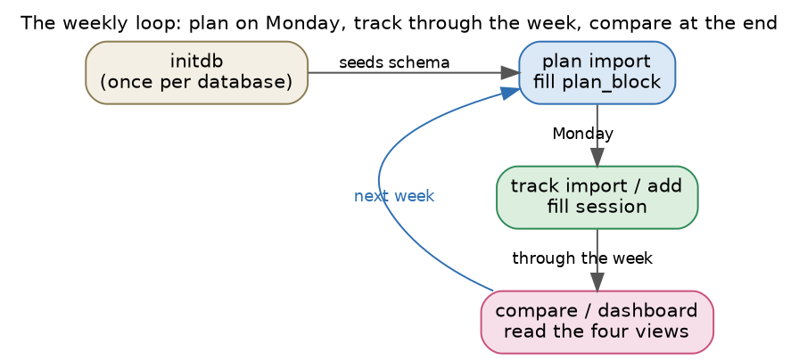
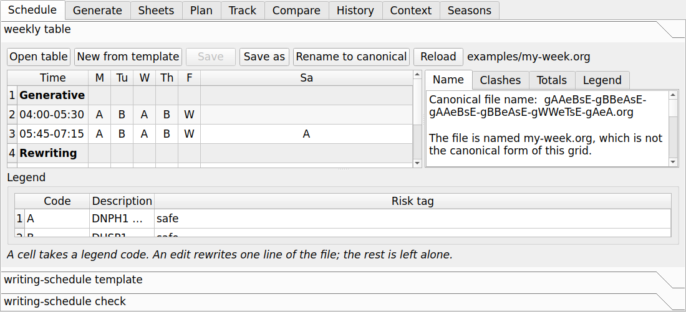
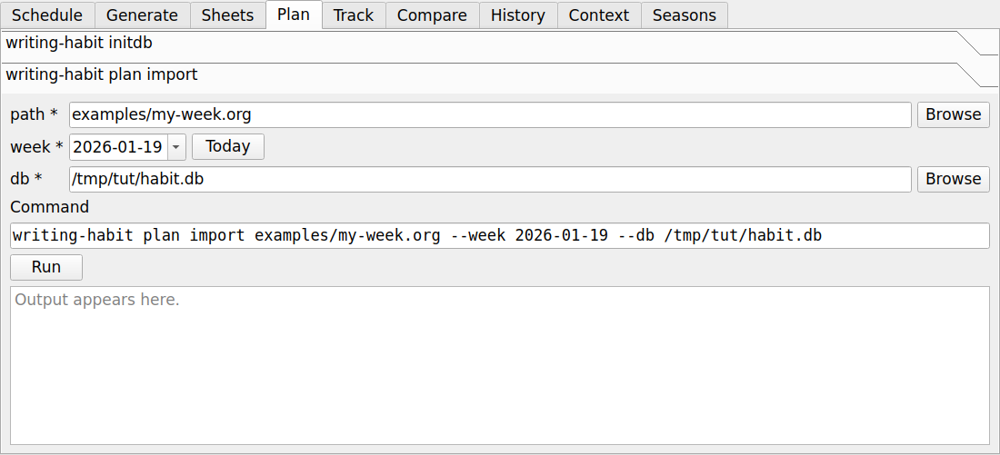
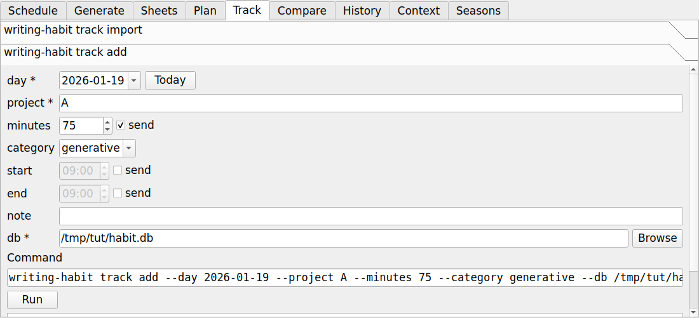
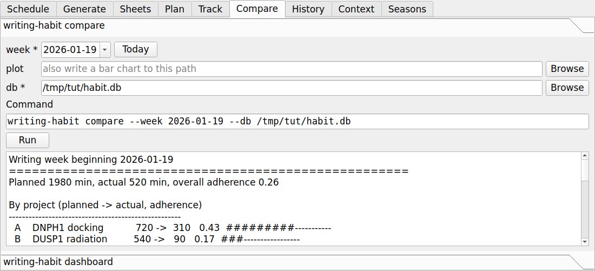
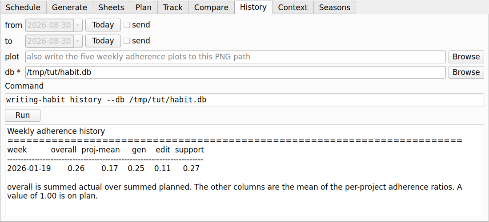
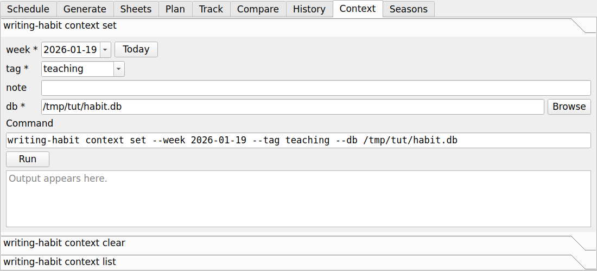
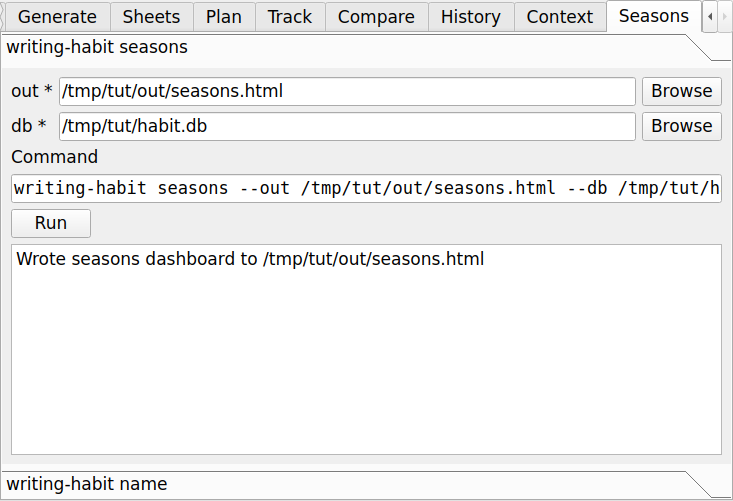
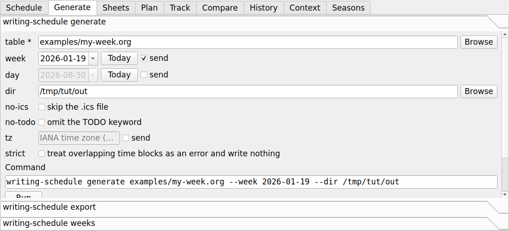
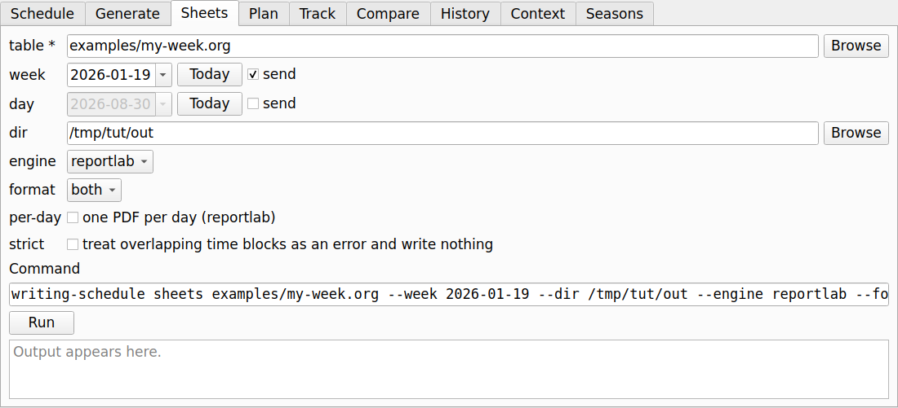

# Tutorial: the same writing week, by point and click

This walkthrough runs the whole loop on a single week without typing a command.
It mirrors the [command-line tutorial](tutorial.md) step for step, so you can
read either one and reach the same database and the same dashboard. The example
files ship in the `examples/` directory of the repository.



Start the interface, which needs the `gui` extra described under
[Installation](installation.md):

```
pip install -e '.[gui]'
writing-habit-gui
```

Two habits are worth forming before the first step. Every form shows the shell
command it will run on the **Command** line, so the interface teaches the
command line rather than hiding it, and every run is recorded in the session log
at the bottom of the window. When you want to script something later, copy the
line you already watched succeed.

## Step 0, the weekly table

The Schedule tab reads the weekly `writing-schedule` table that becomes the
plan. Open `examples/my-week.org` with **Open table**.



The grid shows the week as you laid it out, and the four panels report on it.
**Name** gives the canonical file name for this grid. **Clashes** lists
overlapping blocks and tints the offending cells, which is the same rule
`writing-schedule check` applies. **Totals** gives minutes by day, by project,
and by activity. **Legend** resolves every project letter, and it names codes
defined twice and risk tags that name no class.

A cell takes a project code from the drop-down of legend codes, and every edit
rewrites one line of the file, so a table you open and do not change saves byte
for byte. This step has no command-line equivalent in the other tutorial,
because there the table is edited in Emacs.

## Step 1, seed the database

Open the **Plan** tab and choose `writing-habit initdb`. Give it a path such as
`habit.db` and press **Run**. The database is one SQLite file, created once,
which also seeds the three writing activities.

The path you use here seeds the `db` widget of every other form, so this is the
only time you choose it. The status bar names the database the last command
used, which is how a run against the wrong file becomes visible at once.

## Step 2, import the plan

Still in the **Plan** tab, choose `writing-habit plan import`. Set the table to
`examples/my-week.org` and the week to any date inside the target week, because
the week snaps to the Monday on or before that date.



The importer calls the real `writing-schedule` parser, so every planned block
lands in the `plan_block` table with its project, its activity, and its minutes.
The example table holds twenty-two blocks across five projects, and the output
pane reports twenty-two planned blocks.

## Step 3, track what you actually did

The **Track** tab holds the two ways of recording real sessions. Choose
`writing-habit track import` for a file, set the path to
`examples/actuals.csv`, and leave the format at `csv`. The same form imports a
calendar when you set the format to `ics`, which needs the `ics` extra.

At the end of a day you can add one session with no file at all. Choose
`writing-habit track add`, set the day, the project, the minutes, and the
activity.



The `minutes` field carries a **send** box, because the option is optional: a
session with a start and an end needs no minutes, and the database works them
out. The three formats and their conventions are covered in full under
[Tracking formats](tracking-formats.md).

## Step 4, read the gap as text

Open the **Compare** tab, choose `writing-habit compare`, set the week, and
press **Run**. The report appears in the output pane and in the session log.



The report totals the week, then breaks it down by project, by activity, and by
the safe-against-speculative barbell split, and it closes with the current
streak of consecutive writing days. The numbers match the command-line tutorial
exactly, because the same function produced them.

## Step 5, read the gap as a dashboard

Still in the **Compare** tab, choose `writing-habit dashboard`, set the week and
an output path such as `week.html`, and press **Run**.

The preview dock opens on the right with the page in it. With the `preview`
extra installed the dock renders it faithfully; without it the dock shows a
rough version and says so, and **Open outside** opens the real page in your
browser. The file embeds its own style and script, so it needs no server and no
network, and it carries a light theme and a dark theme.


## Step 6, the week in its longer context

Three tabs answer questions a single week cannot.

**History** draws the cross-week adherence series. Leave the dates empty for
every week on record, or set a range.



**Context** tags a week with the event that shaped it, such as teaching, a
meeting, or data collection, so the seasons dashboard can group by it later. A
tag costs one run and explains a bad week a year from now.



**Seasons** writes the grouped-adherence dashboard, which compares months,
context tags, and schedule shapes. The schedule grouping is the reason the
Schedule tab offers **Rename to canonical**: weeks are grouped by the code
captured at plan import, and that code comes from the file name.



## Step 7, next week's schedule and sheets

The two scheduler tabs turn the same weekly table into the artifacts you work
from.

**Generate** writes the dated schedule `.org` and the `.ics` for a week or a
single day. Import the `.ics` into your calendar and the plan appears there.



**Sheets** draws the printable time-block sheets, either with ReportLab or as
LaTeX, and either as PDF, as org, or as both.



Each of these writes into a directory rather than to a named file, so the
preview dock reads the paths from the lines the command printed and shows each
one it can render.

## What each output is for

The text report is the quickest read. The optional bar chart from the `plot`
field of the compare form is a single image you can drop into a note. The
dashboard is the fullest view, and it is the shared rendering that the Emacs
Lisp twin also produces, byte for byte, from the same database. The three read
one source, so a change to the plan or the sessions changes all three the next
time you run them. The [Dashboard and reports](dashboard.md) page explains each
panel in detail, and [The graphical interface](gui.md) is the reference for the
window itself.
