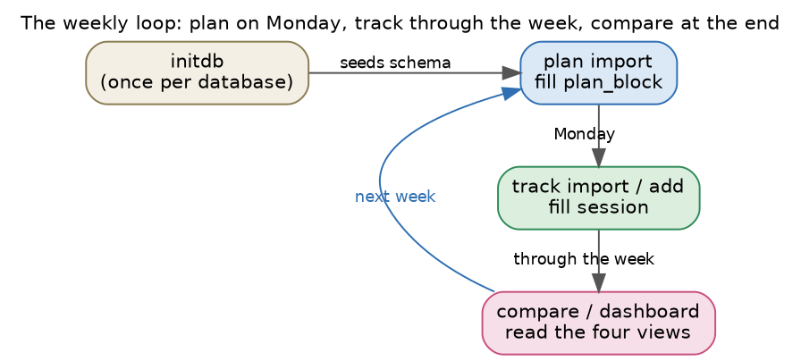
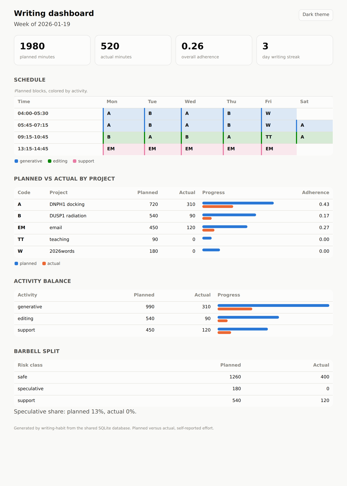

# Tutorial: one writing week from plan to dashboard

This walkthrough runs the whole loop on a single week. You seed a database once,
import a plan, record what you actually did, and read the gap back as a text
report and as a dashboard. The example files ship in the `examples/` directory
of the repository.



## Step 1, seed the database

The database is one SQLite file. Create it once, which also seeds the three
writing activities:

```
writing-habit initdb --db habit.db
```

You can keep more than one database, because every command takes a `--db` path.
A second database is useful when you want to study a separate project or a
separate span of time in isolation.

## Step 2, import the plan

The plan is a weekly `writing-schedule` table. Name any day inside the target
week, because the week snaps to the Monday on or before that date:

```
writing-habit plan import examples/my-week.org --week 2026-01-19 --db habit.db
```

The importer calls the real `writing-schedule` parser, so every planned block
lands in the `plan_block` table with its project, its activity, and its
minutes. The example table holds twenty-two blocks across five projects, so the
command reports twenty-two planned blocks. This step needs the `plan` extra
described under [Installation](installation.md).

## Step 3, track what you actually did

Record real sessions in any of three ways. The universal path is the CSV
template, because every spreadsheet exports CSV:

```
writing-habit track import examples/actuals.csv --format csv --db habit.db
```

If you keep your real work blocks in a calendar, import that calendar instead,
which needs the `ics` extra:

```
writing-habit track import examples/actuals.ics --format ics --db habit.db
```

At the end of a day you can add one session by hand, with no file at all:

```
writing-habit track add --day 2026-01-19 --project A --minutes 75 --category generative --db habit.db
```

The three formats and their conventions are covered in full under
[Tracking formats](tracking-formats.md).

## Step 4, read the gap as text

```
writing-habit compare --week 2026-01-19 --db habit.db
```

The report totals the week, then breaks it down by project, by activity, and by
the safe-versus-speculative barbell split, and it closes with the current
streak of consecutive writing days:

```
Writing week beginning 2026-01-19
====================================================
Planned 1980 min, actual 520 min, overall adherence 0.26

By project (planned -> actual, adherence)
----------------------------------------------------
  A    DNPH1 docking           720 ->  310   0.43  #########-----------
  B    DUSP1 radiation         540 ->   90   0.17  ###-----------------
  EM   email                   450 ->  120   0.27  #####---------------
  TT   teaching                 90 ->    0   0.00  --------------------
  W    2026words               180 ->    0   0.00  --------------------

By activity (Rule 2 balance)
----------------------------------------------------
  generative   990 ->  310  ######--------------
  editing      540 ->   90  ###-----------------
  support      450 ->  120  #####---------------

By barbell class (Rule 6 drift)
----------------------------------------------------
  safe         1260 ->  400
  speculative   180 ->    0
  support       540 ->  120
  speculative share  planned 12%  actual 0%

Current streak of consecutive writing days: 3
```

## Step 5, read the gap as a dashboard

The same numbers become a self-contained web page, with the week's schedule
redrawn as a colored grid and the comparison shown as tiles, meters, and
tables:

```
writing-habit dashboard --week 2026-01-19 --out week.html --db habit.db
```

Open `week.html` in any browser. The file embeds its own style and script, so
it needs no server and no network. It carries a light theme and a dark theme,
and a button in the top corner switches between them.



## What each output is for

The text report is the quickest read, and it lives in your terminal or a log.
The optional bar chart from `compare --plot week.png` is a single image you can
drop into a note. The dashboard is the fullest view, and it is the shared
rendering that the Emacs Lisp twin also produces, byte for byte, from the same
database. The three read one source, so a change to the plan or the sessions
changes all three the next time you run the commands. The
[Dashboard and reports](dashboard.md) page explains each panel in detail.
